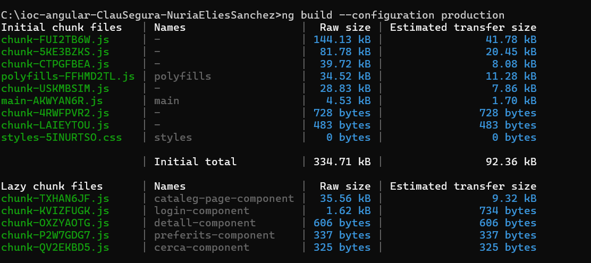

ClauSegura Núria Elies Sánchez

Aplicació per gestionar, recordar i crear contrasenyes per al usuari. L'objectiu es que l'usuari no hagi de pensar a crear contrasenyes robustes i que a més aquesta sigui emmagatzemada a l' app per tal que l'usuari pugui consultar-la en qualsevol moment. 

Requisits utilitzats: Angular 18, SCSS, Standalone, SSR desactivat, git (GitHub).

Configuració inicial completada i verificada. 
---------------Iniciació de Git
---------------Creació de les branques
---------------Readme

EXERCICI 5 EAC4=

# ClauSegura – Aplicació Angular

## 1. Descripció del projecte
Aplicació que permet gestionar contrasenyes i elements guardats, amb rutes protegides i components optimitzats.

## 2. Mapa de rutes

| Path | Component | Accés |
|------|-----------|--------|
| /cataleg | CatalegPageComponent | Públic |
| /cerca | CercaPageComponent | Públic |
| /preferits | PreferitsPageComponent | Privat |
| /login | LoginPageComponent | Públic |
| /detall/:id | DetallComponent | Privat |

## 3. Execució en local

git clone [https://github.com/nuriaelies/ioc-angular-ClauSegura-NuriaEliesSanchez.git]
cd [ioc-angular-ClauSegura-NuriaEliesSanchez]
npm install
ng serve
Obrir: http://localhost:4200

## 4. Build de producció

ng build --configuration production

Els fitxers optimitzats es generen a `dist/`.

**Mida del bundle:**

## 5. Credencials de prova

Email: admin@test.com  
Contrasenya: 1234

